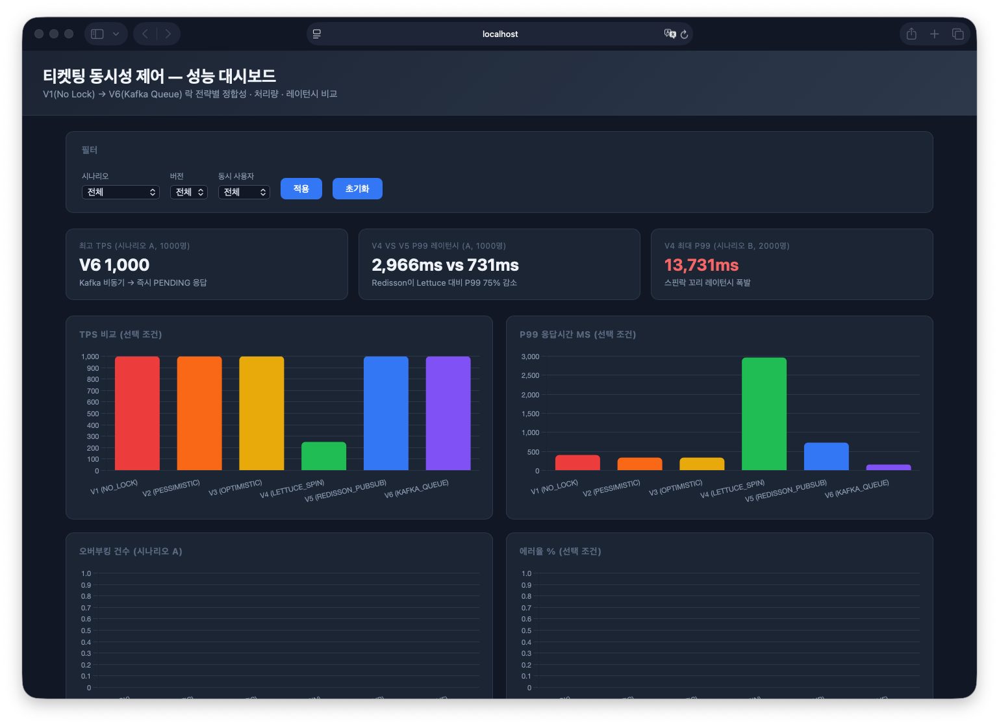
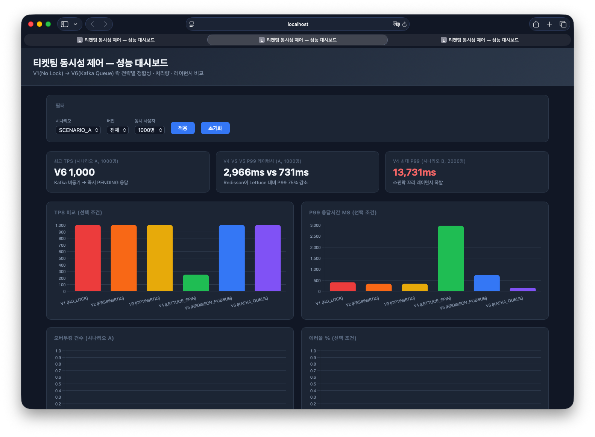
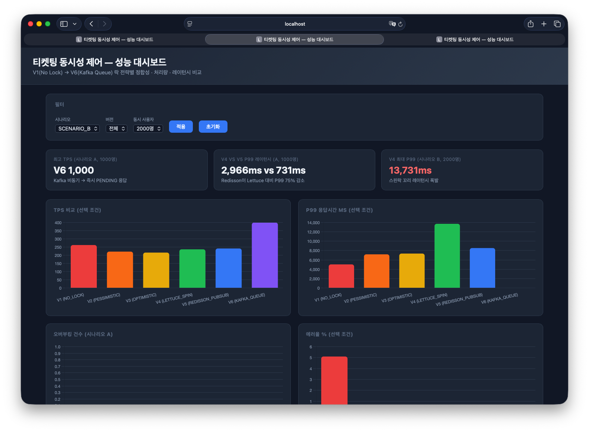

# 티켓팅 동시성 제어 포트폴리오

대용량 트래픽 환경에서 발생하는 **동시성 이슈를 6가지 락 전략으로 해결**하고,  
각 방식의 성능과 트레이드오프를 **Gatling 실측 데이터**로 비교한 백엔드 포트폴리오입니다.

> 단순히 "Redis 썼습니다"가 아닌, **왜 그 락을 선택했는지 근거를 데이터로 제시**합니다.

---

## 목차

1. [프로젝트 개요](#프로젝트-개요)
2. [기술 스택](#기술-스택)
3. [아키텍처](#아키텍처)
4. [버전별 구현 전략](#버전별-구현-전략)
5. [부하 테스트 결과](#부하-테스트-결과)
6. [대시보드](#대시보드)
7. [실행 방법](#실행-방법)
8. [핵심 트레이드오프](#핵심-트레이드오프)
9. [면접 예상 질문](#면접-예상-질문)
10. [지식 정리 문서](#지식-정리-문서)

---

## 프로젝트 개요

| 항목 | 내용 |
|------|------|
| **목표** | 동시성 제어 방식별 정합성·성능 실측 비교 |
| **타겟 직무** | 백엔드 (Java / Spring) |
| **시나리오** | 100장 티켓에 수천 명이 동시 접속하는 극한 경합 상황 |
| **비교 지표** | 오버부킹 건수, TPS, P99 응답시간, 에러율 |

### 구현한 락 전략

| 버전 | 방식 | 핵심 기술 |
|------|------|---------|
| V1 | No Lock (기준선) | 동시성 이슈 의도적 발생 |
| V2 | DB 비관적 락 | `SELECT ... FOR UPDATE` |
| V3 | DB 낙관적 락 | `@Version` + 재시도 |
| V4 | Redis 스핀 락 | Lettuce `SETNX` + Spin Wait |
| V5 | Redis Pub-Sub 락 | Redisson `RLock` |
| V6 | Redis 선점 + Kafka 비동기 DB | Redis DECR 즉시 SUCCESS/FAIL + Kafka DB 처리 |
| V5CB | Circuit Breaker + Fallback Chain | Resilience4j CB — Redis 장애 시 V2 자동 폴백 |

---

## 기술 스택

| 분류 | 기술 |
|------|------|
| Language | Java 17 |
| Framework | Spring Boot 4.0.6 (Spring Framework 7.x) |
| ORM | Spring Data JPA / Hibernate 7.x |
| DB | MySQL 8.x |
| Cache / Lock | Redis 7.x (Lettuce, Redisson 3.50.0) |
| Message Queue | Apache Kafka 3.x |
| 부하 테스트 | Gatling 3.9.5 |
| 결과 시각화 | Thymeleaf + Chart.js |
| 빌드 | Gradle |

---

## 아키텍처

```
클라이언트
    │
    ▼
Spring Boot (V1~V6 Controller)
    │
    ├── V1~V3: JPA → MySQL (DB 레벨 락)
    │
    ├── V4~V5: Redis → MySQL (애플리케이션 레벨 분산 락)
    │         V4: Lettuce SETNX Spin Lock
    │         V5: Redisson Pub-Sub Lock
    │
    ├── V5CB: V5 → [Circuit Breaker] → MySQL  (정상 시)
    │               └── Redis 장애 → V2(DB 비관적 락) 자동 폴백
    │
    └── V6: Redis DECR (즉시 SUCCESS/FAIL 반환)
              └── 성공 시 → Kafka Topic → Single Consumer → MySQL (비동기 DB 저장)
```

### 도메인 기반 패키지 구조

```
src/main/java/com/example/ticketing/
├── concert/          # 공연 도메인 (재고 관리)
├── reservation/
│   ├── controller/   # V1~V6, V5CB 각 버전별 컨트롤러
│   ├── service/      # V1~V6, V5CB 각 버전별 서비스 (락 전략 구현)
│   └── kafka/        # Kafka Producer / Consumer (V6)
├── payment/          # 결제 도메인 (Mock, 100~200ms 지연)
├── dashboard/        # 성능 결과 저장 + Thymeleaf 대시보드
└── global/
    ├── config/       # RedissonConfig, KafkaConfig, ResilienceConfig
    ├── resilience/   # CircuitBreakerStatsHolder, ChaosAspect
    └── exception/    # GlobalExceptionHandler
```

---

## 버전별 구현 전략

### V1 — No Lock (기준선)

동시성 이슈를 **의도적으로 발생**시켜 기준 데이터를 확보합니다.

```java
// TicketServiceV1.java
@Transactional
public ReserveResponse reserveTicket(Long concertId, Long userId) {
    Concert concert = findConcertById(concertId);
    validateStockAvailable(concert);   // race condition 발생 지점
    decreaseStock(concert);
    return saveReservation(concert, userId);
}
```

**결과**: `lost update` — 다수의 쓰기가 서로를 덮어씀 → 재고보다 적은 예약 생성

---

### V2 — DB 비관적 락

```java
// ConcertRepository.java
@Lock(LockModeType.PESSIMISTIC_WRITE)
@Query("SELECT c FROM Concert c WHERE c.id = :id")
Optional<Concert> findByIdWithPessimisticLock(@Param("id") Long id);
```

```sql
-- 실제 실행 쿼리
SELECT * FROM concert WHERE id = 1 FOR UPDATE;
```

**특징**: 트랜잭션 종료까지 다른 트랜잭션이 대기 → 정합성 100%, 대기 큐 증가

---

### V3 — DB 낙관적 락

```java
// Concert.java
@Version
private Long version;   // 충돌 시 ObjectOptimisticLockingFailureException

// OptimisticLockRetryer.java
public <T> T executeWithRetry(Supplier<T> action, int maxRetry) {
    for (int attempt = 1; attempt <= maxRetry; attempt++) {
        try { return action.get(); }
        catch (ObjectOptimisticLockingFailureException e) {
            log.info("[V3] 충돌, 재시도 - 시도={}", attempt);
        }
    }
    throw new ReservationFailedException();
}
```

**특징**: 충돌이 드물 때 유리 / 충돌이 많으면 재시도 폭발 → **티켓팅에 부적합**

---

### V4 — Redis Lettuce Spin Lock

```java
// TicketServiceV4.java (트랜잭션 분리 핵심)
public ReserveResponse reserve(Long concertId, Long userId) {
    acquireSpinLock(concertId);             // ← @Transactional 밖
    try {
        return transaction.reserveInTransaction(concertId, userId);  // ← 별도 빈, @Transactional
    } finally {
        lettuceLockRepository.releaseLock(concertId);  // 트랜잭션 커밋 후 해제 보장
    }
}

private void acquireSpinLock(Long concertId) {
    while (!lettuceLockRepository.tryLock(concertId)) {
        Thread.sleep(SPIN_WAIT_MS);  // 100ms 간격 폴링
    }
}
```

**특징**: 락 해제 시까지 Redis에 지속 폴링 → 부하 증가, 꼬리 레이턴시 폭발

---

### V5 — Redis Redisson Pub-Sub Lock

```java
// TicketServiceV5.java
public ReserveResponse reserve(Long concertId, Long userId) {
    RLock lock = redissonClient.getLock("lock:concert:" + concertId);
    // 락 해제 이벤트 구독 → 불필요한 폴링 제거
    if (!lock.tryLock(LOCK_WAIT_SEC, LOCK_LEASE_SEC, SECONDS)) {
        throw new LockAcquisitionFailedException(concertId);
    }
    try {
        return transaction.reserveInTransaction(concertId, userId);  // 별도 빈, @Transactional
    } finally {
        if (lock.isHeldByCurrentThread()) lock.unlock();
    }
}
```

**특징**: 락 해제 시 Pub-Sub 이벤트로 대기 쓰레드에 통보 → Redis 부하 감소, TPS 향상

---

### V6 — Redis 선점 + Kafka 비동기 DB

```java
// TicketServiceV6.java — Redis DECR로 즉시 재고 선점
@Override
public ReserveResponse reserve(Long concertId, Long userId) {
    long remaining = redisStockRepository.decrement(concertId);
    if (remaining < 0) {
        redisStockRepository.increment(concertId);  // 복구
        throw new SoldOutException(concertId);
    }
    ticketProducer.publishReservationRequest(concertId, userId);  // DB 저장 비동기 위임
    return new ReserveResponse(null, ReservationStatus.SUCCESS);  // 즉시 SUCCESS 반환
}

// TicketConsumer.java — DB 저장만 담당 (재고 판단 없음)
@KafkaListener(topics = "${ticketing.kafka.topic}", concurrency = "1")
public void consumeReservationRequest(String payload) {
    ReservationMessage msg = deserialize(payload);
    concert.decrease();
    reservationRepository.save(Reservation.of(msg.concertId(), msg.userId(), SUCCESS));
}
```

**특징**: Redis DECR 원자성으로 재고를 즉시 선점 → SUCCESS/FAIL 즉시 반환. DB 저장은 성공자에 한해 Kafka Consumer가 비동기 처리. `reservationId`는 응답에 포함되지 않음(비동기 저장).

---

### V5CB — Circuit Breaker + Graceful Degradation

V5(Redisson) Redis 장애 시 V2(DB 비관적 락)으로 **자동 폴백**하는 Resilience4j Circuit Breaker.

```
요청
 │
 ▼
[Circuit Breaker]
 ├── CLOSED (정상): V5 Redisson → MySQL
 ├── OPEN   (장애): 즉시 폴백 → V2 Pessimistic Lock → MySQL
 └── HALF_OPEN (복구 테스트): 소수 요청 통과 → 성공 시 CLOSED 복귀
```

```java
// TicketServiceV5CB.java
public ReserveResponse reserve(Long concertId, Long userId) {
    try {
        ReserveResponse response = redisLockCircuitBreaker.executeCheckedSupplier(
                () -> ticketServiceV5.reserve(concertId, userId)
        );
        statsHolder.incrementRedisPath();
        return response;
    } catch (Throwable e) {
        if (e instanceof ConcertNotFoundException cnfe)       throw cnfe;
        if (e instanceof LockAcquisitionFailedException lafe) throw lafe;
        if (e instanceof SoldOutException soe)                throw soe;
        // RedisCommandTimeoutException 등 인프라 장애 → 폴백
        statsHolder.incrementFallbackPath();
        return ticketServiceV2.reserve(concertId, userId);
    }
}
```

**Gatling 실측 (CHAOS=redis_block, 500명)**:

| 시나리오 | P99 | Mean | TPS | 에러율 | fallbackRatio |
|---------|-----|------|-----|--------|---------------|
| CLOSED (정상) | 1,150ms | 755ms | 661 | 0% | 0% |
| OPEN → V2 폴백 | 411ms | 257ms | 1,946 | 0% | 100% |

> 장애 상황에서도 에러율 0% — CB가 V2로 자동 폴백하여 서비스 중단 없음

---

## 부하 테스트 결과

### 시나리오 A — 극한 경합 (재고 100장, 동시 1,000명)

| 버전 | 방식 | P99 | Mean | TPS | 오버부킹 |
|------|------|-----|------|-----|----------|
| V1 | No Lock | 407ms | 273ms | 1,000 | 0 (lost update) |
| V2 | Pessimistic | 338ms | 228ms | 1,000 | 0 ✅ |
| V3 | Optimistic | 338ms | 252ms | 1,000 | 0 ✅ |
| V4 | Spin Lock | **2,966ms** | 627ms | 250 | 0 ✅ |
| V5 | Redisson | 731ms | 451ms | 1,000 | 0 ✅ |
| V6 | Kafka | 155ms | 101ms | 1,000 | 0 ✅ |

> V4 TPS가 낮은 이유: `Thread.sleep(100ms)` 스핀 대기가 쓰레드를 점유 → 동시 처리 수 제한

### 시나리오 B — 실제 티켓팅 흐름 (재고 100,000장, 동시 2,000명)

전체 플로우: 공연 목록 → 상세 조회 → 예약 → 결제 (think time 포함)

| 버전 | 방식 | P99 | req/s | 에러율 |
|------|------|-----|-------|--------|
| V1 | No Lock | 5,039ms | 262 | 5.1% |
| V2 | Pessimistic | 7,194ms | 222 | 0% |
| V3 | Optimistic | 7,359ms | 216 | 0% |
| V4 | Spin Lock | **13,731ms** | 236 | 0% |
| V5 | Redisson | 8,538ms | 241 | 0% |
| V6 | Kafka | **2ms** | 400 | 0% |

> V4 P99 13.7초: 2,000명의 스핀 대기가 Redis를 지속 폴링 → 꼬리 레이턴시 폭발  
> V6: 예약 자체는 즉시 PENDING 반환 → P99 2ms, 실제 처리는 비동기

---

## 대시보드

`http://localhost:8080/dashboard` — Thymeleaf + Chart.js 실시간 성능 비교 대시보드

### 전체 뷰 (기본 — 시나리오 A, 1,000명)



### 시나리오 A 필터 (극한 경합, 1,000명)



V4 스핀락의 TPS 급감(250)과 P99 폭발(2,966ms)이 차트에서 명확히 드러납니다.

### 시나리오 B 필터 (실제 티켓팅 흐름, 2,000명)



V4 P99 13,731ms vs V6 P99 2ms — Kafka 비동기 방식의 압도적 레이턴시 차이.

**제공 기능**:
- 시나리오(A/B) · 버전(V1~V6) · 동시 사용자 수 필터
- TPS / P99 / 오버부킹 / 에러율 막대 차트
- 전체 결과 테이블 (삭제 가능)
- **Circuit Breaker 탭**: Redis 경로 vs V2 폴백 분포 차트 + TPS/에러율 비교

---

## 실행 방법

### 사전 요구사항

- Java 17+
- MySQL 8.x (localhost:3306, DB: `ticketing`)
- Redis 7.x (localhost:6379)
- Docker (Kafka용)

### 1. Kafka 기동

```bash
docker-compose -f kafka-docker-compose.yml up -d
```

### 2. DB 초기화

```sql
CREATE DATABASE IF NOT EXISTS ticketing CHARACTER SET utf8mb4;
```

### 3. 애플리케이션 실행

```bash
./gradlew bootRun
```

> `application.yml`의 MySQL 비밀번호를 환경에 맞게 수정하세요.

### 4. 초기 데이터 삽입

```bash
# 공연 생성 (앱 실행 후)
mysql -u root -p ticketing -e "
  INSERT INTO concert (title, total_stock, stock, version)
  VALUES ('테스트 콘서트', 100000, 100000, 0);
"
```

### 5. 부하 테스트 실행

```bash
cd load-test/gatling

# 시나리오 A — 극한 경합 (재고 100장으로 reset 필요)
curl -X POST "http://localhost:8080/api/concerts/1/reset?stock=100"
mvn gatling:test -Dgatling.simulationClass=ScenarioASimulation -DVERSION=v5 -DUSERS=1000

# 시나리오 B — 처리량 측정 (재고 100,000장으로 reset 필요)
curl -X POST "http://localhost:8080/api/concerts/1/reset?stock=100000"
mvn gatling:test -Dgatling.simulationClass=ScenarioBSimulation -DVERSION=v5 -DUSERS=1000
```

### 6. 대시보드 확인

`http://localhost:8080/dashboard`에서 결과를 확인합니다.

---

## 핵심 트레이드오프

```
정합성:    V2 = V3 = V4 = V5 = V5CB = V6 >> V1
TPS:       V6 > V5CB ≈ V5 ≈ V2 ≈ V3 > V4 > V1
P99:       V6 << V5CB ≈ V5 < V2 ≈ V3 << V4
에러율:    V2=V3=V5=V5CB=V6=0% ≤ V4 < V1
운영복잡:  V1 < V2 < V3 < V4 < V5 < V5CB < V6
장애내성:  V5CB (자동 폴백) > V5 > V4 > V2 = V3 > V1
```


## 프로젝트 구조

```
ticketing-system/
├── src/main/java/com/example/ticketing/
│   ├── concert/             # 공연 엔티티, 재고 관리
│   ├── reservation/
│   │   ├── controller/      # ReserveControllerV1 ~ V6, V5CB
│   │   ├── service/         # TicketServiceV1 ~ V6, V5CB
│   │   └── kafka/           # TicketProducer, TicketConsumer
│   ├── payment/             # 결제 Mock (100~200ms 지연)
│   ├── dashboard/           # TestResult 엔티티 + Chart.js 대시보드
│   └── global/
│       ├── config/          # RedissonConfig, KafkaConfig, ResilienceConfig
│       ├── resilience/      # CircuitBreakerStatsHolder, ChaosAspect
│       └── exception/       # GlobalExceptionHandler
├── load-test/gatling/
│   ├── ScenarioASimulation.scala   # 극한 경합 시나리오
│   ├── ScenarioBSimulation.scala   # 실제 티켓팅 흐름 시나리오
│   ├── CBSimulation.scala          # Circuit Breaker (CHAOS=none / redis_block)
│   └── common/Feeders.scala
├── docs/
│   ├── performance-report.md       # 전체 성능 비교표 (시나리오A/B × 500/1000/2000명 + CB)
│   └── knowledge/                  # 면접 완벽 답변 기준 지식 정리 (Level 1~12)
└── kafka-docker-compose.yml
```
